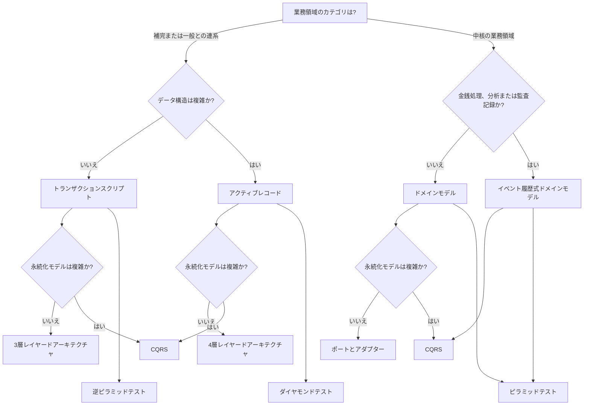

# はじめに

近年、ソフトウェア開発の現場では「ドメイン駆動設計（DDD）」という言葉を耳にする機会が増えてきた。
概念は理解しているが、実際の現場でどのようにドメイン知識をモデル化し、設計に落とし込むか悩む人も多いのではないだろうか。
そんな中で出会ったのが Vlad Khononov 著、増田 亨、綿引 琢磨 訳「ドメイン設計をはじめよう」という本である。

https://www.oreilly.co.jp/books/9784814400737/

この本は、いわゆる「DDD の完全ガイド」ではなく、ドメイン設計という考え方を現場レベルで理解し、実践するための本になっている。
理論よりも実際の開発者視点で、トランザクションスクリプト、アクティブレコード、ドメインモデルといった設計手法を、どのような状況で使い分けるべきかを丁寧に解説してくれている。

本記事では、この書籍を読んで印象に残ったポイントや、自分の理解を整理するためのメモを兼ねて内容をまとめていく。
「ドメイン設計に興味はあるけど、まだピンと来ていない」「DDD は難しそう」と感じている方の参考になれば幸いである。

# 本の構成

この本は、大きく分けて次の 4 つの流れで構成されている。

### 第 Ⅰ 部　設計の基本方針

第 Ⅰ 部では、ソフトウェアの設計方針を決めるための考え方をや方法について取り上げている。

```
1 章　事業活動を分析する
2 章　業務知識を発見する
3 章　事業活動の複雑さに立ち向かう
4 章　区切られた文脈どうしの連係
```

### 第 Ⅱ 部　実装方法の選択

第 Ⅱ 部では、ソフトウェアの実装のやり方について、複数の方法を取り上げている。

```
5 章　単純な業務ロジックを実装する
6 章　複雑な業務ロジックに立ち向かう
7 章　時間軸でモデルを作る
8 章　技術方式
9 章　通信
```

### 第 Ⅲ 部　ドメイン駆動設計の実践

第 Ⅲ 部では、ドメイン駆動設計の考え方とやり方について、より実践的な内容を具体的な「経験則」から取り上げている。

```
10 章　設計の経験則
11 章　設計を進化させる
12 章　イベントストーミング
13 章　現実世界のドメイン駆動設計
```

### 第 Ⅳ 部　他の方法論や設計技法との関係

第 Ⅳ 部では、ドメイン設計を他のアーキテクチャや方法論とどう組み合わせるかを扱っている。

```
14 章　マイクロサービス
15 章　イベント駆動型アーキテクチャ
16 章　データメッシュ
```

# 各章について

### 1 章 事業活動を分析する

事業活動（ドメイン）を分析し、プロジェクトの「業務領域（サブドメイン）」がどのように構成されているかを分析することが大事。
分析するにあたって、各サブドメインを「中核」「一般」「補完」に分類する。
「中核」は、差別化・競争優位を生む活動領域。
「一般」は、既存の解決手段(パッケージソフトや外部サービス)が手に入る業務領域。
「補完」は、課題の解決手段がはっきりしてる業務領域。
業務領域を設計の起点と捉え、「まず何を価値にするか(中核)」を定めることで、設計方針（どこにリソースを集中すべきか）が見えてくる。

### 2 章　業務知識を発見する

業務知識を発見し、開発チームと業務エキスパートが「同じ言葉（ユビキタス言語相当語）」を共有しながらモデル化する基盤を築く必要がある。
同じ言葉（same language）」を使って、業務と開発の間で共通理解を作る。
業務エキスパートと開発者が対話を重ね、業務における重要な概念・ルールを掘り下げる。

### 3 章　事業活動の複雑さに立ち向かう

業務が大きくなり各エキスパート／機能が異なる観点を持つと、「同じ言葉」が異なる意味を持つようになる。
そこで「区切られた文脈」という考えを用いて、言葉やモデルの一貫性を担保するスコープを定める。
業務領域は「発見」するものであり、区切られた文脈は「設計」するもの。

### 4 章　区切られた文脈どうしの連係

分割した文脈（コンテキスト）同士がどのように連携・統合するかを設計する。
文脈どうしの関係性として「良きパートナー」「利用者／供給者」「モデル変換装置（アンチ腐敗層）」「共用サービス」などがある。
文脈間連携を可視化する「コンテキストマップ（文脈の地図）」が有効。
連携時に「共用モデル」による副作用（他文脈へ影響が波及する）を避けるため、変換アダプタや明確な契約（インタフェース）設計を意識する。

### 5 章　単純な業務ロジックを実装する

単純な業務ロジック(補完的な業務領域、一般的な業務領域用の外部サービスとの連携、区切られた文脈どうしを連携する時のモデル変換)では、重厚なドメインモデルを持たず、トランザクションスクリプト／アクティブレコードといったシンプルな方式が有効である。

#### トランザクションスクリプト

- 業務処理（トランザクション）ごとに手続き（スクリプト）を **1 つの関数やメソッド**として書く設計
- 「注文処理」「請求処理」「入金処理」といった 1 件 1 件の業務を 1 つの関数で完結させるイメージ
- 構造がシンプルで理解しやすいが、同じような計算・検証ロジックが複数スクリプトに重複しやすい

#### アクティブレコード

- データベースのテーブル 1 つに対して、対応するクラス（レコードの表現）を作り、
  そのクラス自身が**データ操作（CRUD）と業務ロジック**を持つ設計
- 複雑なビジネスルールを扱い始めると、エンティティが肥大化し、関心事が混ざる（Fat Model 問題）

### 6 章　複雑な業務ロジックに立ち向かう

業務ロジックが複雑な文脈（たとえば「中核」サブドメイン）に対して、ドメインモデルの設計と実装を解説。
ドメインモデルを構築するための基本構成要素は、以下。
| 要素 | 説明 |
| -------------------------- | ----------------------------- |
| **エンティティ (Entity)** | 一意の ID を持ち、ライフサイクルを持つ（例：注文、顧客） |
| **値オブジェクト (Value Object)** | 属性の集合であり、値で同一性が決まる（例：住所、金額） |
| **集約 (Aggregate)** | ビジネス上、一貫性を保つ必要があるオブジェクトのまとまり。関連するエンティティのあつまり。 |
| **集約ルート（Aggregate Root）** | 集約の入り口となるエンティティ。外部からアクセスできるのはこのルートだけ。|
| **リポジトリ (Repository)** | 永続化（DB 操作）を隠蔽し、モデルを取得・保存する役割 |
| **サービス (Domain Service)** | 集約や値オブジェクトにカプセル化することが不自然な業務ロジックを担当 |
| **ドメインイベント（Domain Event）** | 業務上の出来事を表す |

### 7 章　時間軸でモデルを作る

ドメインが時間的な変化を含む場合（たとえば履歴管理・イベント記録など）、時間軸をモデルに取り入れた設計（例：イベントソーシング、イベント履歴式ドメインモデル）をどう扱うかを解説。
通常のシステムでは、**現在の状態（State）**をデータベースに保存。
「残高＝ 1000 円」など、最終的な結果だけを記録。
イベントソーシグでは、「なぜ 1000 円になったのか」という**履歴（出来事＝イベント）**を保存。
イベントソーシングや履歴モデルは設計・運用コストが高いため、必要性と実装コストのバランスを検討

### 8 章　技術方式

ドメインモデルを実装へ橋渡しするためのアーキテクチャパターンを解説。

#### レイヤードアーキテクチャ（Layered Architecture）

以下のように階層を分け、依存関係を下方向に限定。

```
UI層
↓
アプリケーション層
↓
ドメイン層
↓
インフラ層
```

各層が役割を分担しやすい。
トランザクションスクリプトまたはアクティブレコードで実装するシステムに適している。
ただし、層を越えて依存しやすくなり、肥大化（アンチパターン）しやすい。

#### ポートとアダプター（クリーンアーキテクチャ／ヘキサゴナルアーキテクチャ）

ビジネスロジックを外部技術から切り離すアーキテクチャ。
ドメイン層が「中心」、外側に「ポート（インターフェース）」と「アダプター（実装）」を配置。
ドメインモデルを用いた業務ロジックの実装に適している。
技術的要素（DB・API・UI）を交換しやすい。
モデルを長期的に保守しやすい。
構造が複雑になり、設計力が求められる。

```
ドメイン層
↑
アプリケーション層
↑
インフラ層
```

#### CQRS（Command Query Responsibility Segregation）

読み取り（Query）と更新（Command）を分離するアーキテクチャ。
イベント履歴式ドメインモデルに適している。
読み取り性能を最適化しやすい。
更新ロジックをドメインモデルに集中できる。
状態同期の難しさが課題になる場合もある。

### 9 章　通信

「区切られた文脈（Bounded Context）」同士の「通信・連携」をどう設計するかを解説。
異なる文脈間でデータや処理をやり取りするときは、同期通信か非同期通信を選び、モデルの独立性と整合性の保ち方を慎重に設計する必要がある。

#### モデルをそのまま共有する

→ 同じモデルを複数の文脈で使用（例：共通ライブラリ）。
**利点:** 実装コストが低く、即座に連携できる。
**欠点:** 一方の変更が他方に波及する「腐敗（corruption）」のリスク。

> 小規模・密結合な文脈間では有効だが、境界を曖昧にしやすい。

#### モデル変換装置を設ける

→ 外部文脈との間に**変換モデル** を置き、自文脈内のモデルへ変換する。

**利点:** 影響範囲を限定し、モデルの独立性を保てる。
**欠点:** 実装・テストコストが増す。

> 境界を守りたいときに最適。
> 変換を通じて「他文脈の概念をそのまま持ち込まない」ことが重要。

#### サービス連携（API / イベント）

→ REST API（同期）や メッセージング（非同期、Kafka / RabbitMQ など）を介して通信。

- **同期通信:**
  呼び出し元が相手の応答を待つ。リアルタイム性が必要な場面で使う。
  ただし相手が落ちると全体が止まるリスクがある。

- **非同期通信:**
  イベントやメッセージを発行し、相手が後で処理する。
  柔軟で独立性が高いが、再送・重複制御などの複雑さが増す。

---

非同期通信により分散した文脈（またはマイクロサービス）間で、データ整合性を保つために　**サーガ（Saga）＋送信箱（Outbox）** を組み合わせて使う。

#### サーガ（Saga）：分散プロセスの一貫性を保つ

複数のトランザクションをまたぐ業務処理を、分散的に制御する。
分散した複数の処理を「論理的に 1 つの業務フロー」として扱う。

#### 送信箱（Outbox）：イベントの確実な配信を保証

非同期通信では、「データは保存できたがイベント送信に失敗した」という事態が起きやすい。
この問題を解決するのが **送信箱（Transactional Outbox）パターン**。

1. アプリケーションのトランザクション内で「業務データ」と「イベント」を同時に DB へ保存

2. 送信箱テーブル（outbox）に溜まったイベントを、別のプロセスが安全に送信する

3. 送信成功後に削除／マークすることで再送制御

### 10 章　設計の経験則

技術方針とテスト方針の判定方法について解説。



### 11 章　設計を進化させる

変化は避けられず、事業もソフトウェアも常に変わる。
事業活動の変化に合わせて、業務領域（ドメイン） の変化を捉え、設計に反映し続ける必要がある。
業務領域の拡張が必要になったら、小さく分割し直す設計を検討する。
何でもできる万能モデルにしようとせず、その文脈の問題を解決するモデルに専念する。
集約はできるだけ小さく保つ。

### 12 章　イベントストーミング

イベントストーミングは、参加者全員で業務プロセスを可視化し、共通理解を形成するための協調型ワークショップ。
イベント（業務上の出来事）を使って対話することで、業務知識が自然と引き出され、モデル作成が進む。
参加者全員が同じモデルをベースに議論できる点が大きなメリット。

### 13 章　現実世界のドメイン駆動設計

既存システムを改善する際も、新規開発と同じく 自社の事業目標と業務領域を正しく理解するところから始める ことが重要。
業務領域を分類し、どこを改善すべきかを明確にしたうえで、段階的にリファクタリングやシステム再構築を進めるべき。
また、ドメイン駆動設計は組織に完全には浸透していない状況でも、適切な範囲で取り入れ、チーム内で背景・目的・原則を共有して効果的に使うことが重要。

### 14 章　マイクロサービス

マイクロサービス = DDD ではないが、境界づけられたコンテキストは、そのまま「サービス境界」として使える。
マイクロサービスは適切な境界づけが重要であり、その境界は 区切られた文脈（バウンデッドコンテキスト） の範囲と深く結びついている。
文脈を広げすぎると巨大で扱いづらいサービスになり、逆に小さく分割しすぎると泥団子のように複雑な密結合が生まれる。
ドメイン駆動設計（DDD）の考え方は、マイクロサービスの適切な境界を見極める助けとなる。

### 15 章　イベント駆動型アーキテクチャ

区切られた文脈（バウンデッドコンテキスト）ごとに、適切なイベントを選び、事象の連鎖や関連性を正しく捉えることが重要。
イベントは頻度・関連度・周期性などで分類し、状況に応じて使い分けるべき。
これにより、システム間の連携やイベント駆動型アーキテクチャを適切に設計できる。

### 16 章　データメッシュ

分析系データモデルを扱う際には、業務系モデル（トランザクション側）とは異なる特性を理解し、適切な方法でデータを取り扱う必要がある。
データメッシュや CQRS のように、区切られた文脈（バウンデッドコンテキスト） と結びつけてデータを分離・連携させることで、分析モデルを整理し扱いやすくできる。
